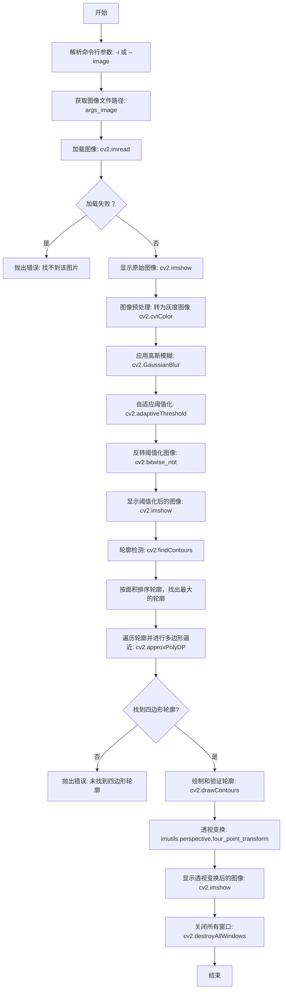

```mermaid
graph TD
    A[开始] --> B[解析命令行参数: -i 或 --image]
    B --> C[获取图像文件路径: args_image]
    C --> D[加载图像: cv2.imread]
    D --> E{加载失败？}
    E -- 是 --> F[抛出错误: 找不到该图片]
    E -- 否 --> G[显示原始图像: cv2.imshow]
    G --> H[图像预处理: 转为灰度图像 cv2.cvtColor]
    H --> I[应用高斯模糊: cv2.GaussianBlur]
    I --> J[自适应阈值化: cv2.adaptiveThreshold]
    J --> K[反转阈值化图像: cv2.bitwise_not]
    K --> L[显示阈值化后的图像: cv2.imshow]
    L --> M[轮廓检测: cv2.findContours]
    M --> N[按面积排序轮廓，找出最大的轮廓]
    N --> O[遍历轮廓并进行多边形逼近: cv2.approxPolyDP]
    O --> P{找到四边形轮廓?}
    P -- 否 --> Q[抛出错误: 未找到四边形轮廓]
    P -- 是 --> R[绘制和验证轮廓: cv2.drawContours]
    R --> S[透视变换: imutils.perspective.four_point_transform]
    S --> T[显示透视变换后的图像: cv2.imshow]
    T --> U[关闭所有窗口: cv2.destroyAllWindows]
    U --> V[结束]


```