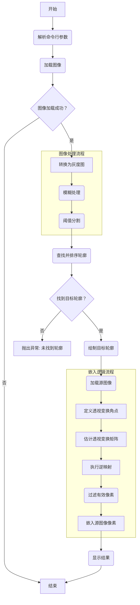

```mermaid
graph TD
    Start[开始] --> ParseArgs(解析命令行参数)
    ParseArgs --> LoadImage(加载图像)
    LoadImage --> CheckImage{"图像加载成功？"}
    CheckImage -- 否 --> End[结束]
    CheckImage -- 是 --> ConvertGray[转换为灰度图]
    ConvertGray --> ApplyBlur(模糊处理)
    ApplyBlur --> Thresholding(阈值分割)
    Thresholding --> FindContours(查找并排序轮廓)
    FindContours --> CheckContours{"找到目标轮廓？"}
    CheckContours -- 否 --> Error1[抛出异常: 未找到轮廓]
    CheckContours -- 是 --> DrawContour(绘制目标轮廓)
    DrawContour --> LoadSourceImage(加载源图像)
    LoadSourceImage --> DefineCorners[定义透视变换角点]
    DefineCorners --> EstimateTransform[估计透视变换矩阵]
    EstimateTransform --> InverseMapping[执行逆映射]
    InverseMapping --> FilterPixels(过滤有效像素)
    FilterPixels --> EmbedImage[嵌入源图像像素]
    EmbedImage --> DisplayImage(显示结果)
    DisplayImage --> End

    subgraph 图像处理流程
        ConvertGray
        ApplyBlur
        Thresholding
    end

    subgraph 嵌入逻辑流程
        LoadSourceImage
        DefineCorners
        EstimateTransform
        InverseMapping
        FilterPixels
        EmbedImage
    end

```